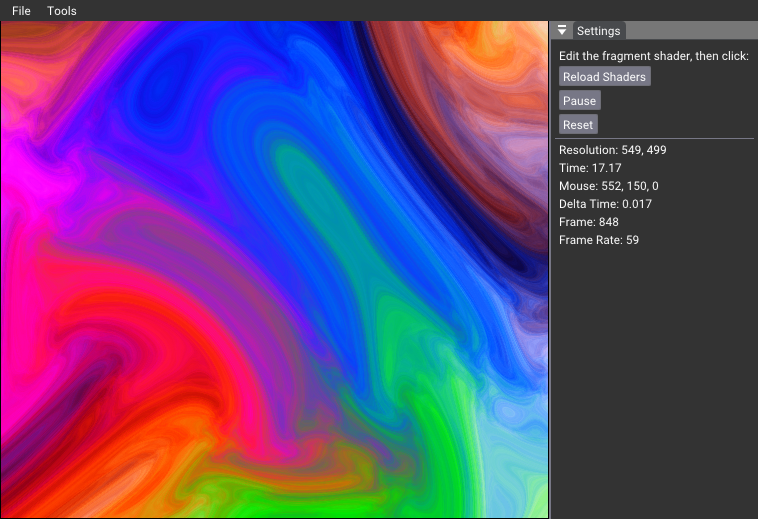
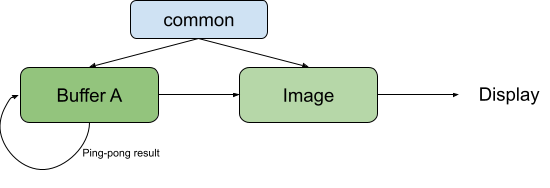

# Tiny ShaderToy

This sample show how to compile shaders on the fly and using multi-stage piple, where the result of a rendering is used by another rendering pass.

It is a very simple version of [ShaderToy](https://www.shadertoy.com/), but allows to test a few shaders. 

## Modifying Shaders

Open in an editor the files: `image.glsl`, `buffer_a.glsl` and `common.glsl`. They are corresponding to the tabs in ShaderToy. 

Copy & Paste the source of each tab in the corresponding file, then press **Reload Shaders**.

## Limitations

1. Only shaders Buffer A and Common is supported. 
2. iChannel0 always have Buffer A connected. 
3. No Textures, Cubemaps, Volumes, Videos or Music